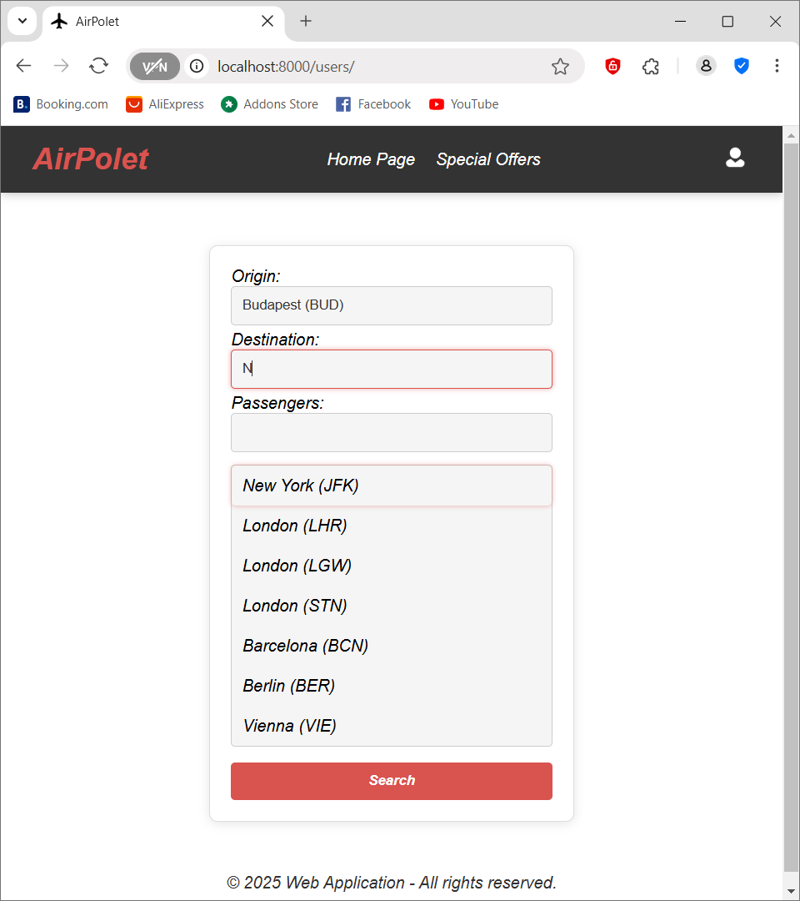

# Airport Booking Web App

A modern and fun flight booking platform!  
Book trips easily and browse **funny, creative special offers** uploaded by airline employees.

## Overview

This project includes two main interfaces:

- **User Interface**
  - Register and log in
  - Book trips
  - Browse special offers
  - Manage personal profile

- **Worker Interface**
  - Employee login
  - Post custom and funny special offers (e.g., _"Carry my suitcase for a week and travel for free"_)
  - Manage worker profile

## Preview

1. **Seat Selector Page**

2. **Flight Search Page**

3. **Login Page**

4. **Special Offers List**

5. **User Profile**

6. **Create Offer (Worker)**


## Features

### User Side
- Register and login
- Book trips
- Browse special offers
- Manage personal profile

### Worker Side
- Employee login
- Create custom special offers

##  Tech Stack

- **Backend:** Django (Python)
- **Frontend:** HTML, CSS, JavaScript, AJAX, React
- **Database:** PostgreSQL
- **Containerization:** Docker

## Additional Tools

- **Testing & Automation:** 
  - Selenium (for browser-based UI testing)
  - Django TestCase and StaticLiveServerTestCase (for unit and integration testing)
- **Security:** Argon2 Password Hashing
- **Scripting & DevOps:** Bash / Shell Scripting, Docker Compose
- **Utilities:** Python Standard Libraries

## Installation

Clone the repository:

```bash
git clone https://github.com/coderpeti/funny-airport.git
cd funny-airport
docker-compose up --build
```
The application will be available at:

http://localhost:8000

## License

This project is open-source and available under the MIT License.

## Author

Created by: Péter Kóder

Email: petercoder.dev@gmail.com

GitHub: coderpeti

YouTube: @peter_koder
